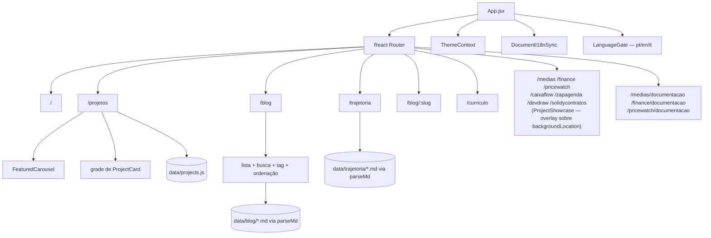

# Arquitetura — Portfólio (gustavodevsite)

Reconstruído por engenharia reversa do código atual (Modo Produto, Fase A, 10/09/2026). O `README.md` da raiz descreve uma versão anterior do projeto (deploy só no GitHub Pages, 4 rotas, sem blog/trajetória/PriceWatch) — este documento reflete o estado real verificado no código, não o README.

## Visão geral

SPA (Single Page Application) sem backend. Todo o conteúdo é estático, versionado como JS/Markdown no próprio repositório, servido via CDN (Vercel). Não há banco de dados, API própria ou autenticação.

## Stack e justificativa

| Camada | Escolha | Por quê (nesta aplicação) |
|--------|---------|---------------------------|
| Framework | React 19 + React Router DOM 7 | SPA com múltiplas rotas e transições animadas entre elas |
| Build | Vite 7 | Dev server rápido, build otimizado, suporte nativo a `import.meta.glob` (usado pra carregar os `.md` de blog/trajetória) |
| Estilo | CSS Modules | Isolamento de estilo por componente sem dependência de runtime CSS-in-JS |
| Animação | Framer Motion | Transições de página com direção (`AnimatePresence` + `PAGE_ORDER`) |
| i18n | i18next + react-i18next | Alternância de idioma da interface (PT/EN/IT), escolhida via `LanguageGate` |
| Testes | Vitest + Testing Library + jsdom | Ambiente de teste configurado em `vite.config.js` (`test.environment: 'jsdom'`) |
| Conteúdo | Markdown com frontmatter YAML custom-parsed | `src/utils/parseMd.js` — parser próprio, não usa `gray-matter` apesar de estar no `package.json` (verificar se a dependência é usada em algum outro lugar antes de remover) |

## Estrutura de pastas (verificada, não a do README antigo)

```
src/
├── components/       # Layout, Navigation, SideMenu, ProfileSection, TechStack, ProjectCard,
│                      # FeaturedCarousel, ProjectShowcase, VideoPlayer, ThemeToggle,
│                      # LanguageSelector, LanguageGate, HeroSection, IntroSection, Timeline,
│                      # FeatureCard, ApiEndpoint, Footer, Blog/* (PostListItem, ReadingProgress)
├── pages/            # Home, AllProjects, Trajetoria, Blog, BlogPost, Curriculo,
│                      # MediasAPI/MediasDocs, FinanceAPI/FinanceDocs, PriceWatch/PriceWatchDocs,
│                      # CaixaFlow, ZapAgenda, DevDraw, SolidyContratos
├── context/           # ThemeContext.jsx (tema), NavigationContext.js (direção de transição),
│                      # LanguageGateContext.js (reabrir o seletor de idioma a partir do menu)
├── data/              # projects.js, technologies.js, socialLinks.js, blog/*.md, trajetoria/*.md
├── hooks/             # useSwipe.js (aceita um `targetRef` opcional pra escopar o gesto)
├── i18n/              # config.js + locales/{pt,en,it}.json
├── utils/             # parseMd.js, readingTime.js, adjacentPosts.js, tagCounts.js, paths.js
├── styles/            # global.css (variáveis de tema)
├── test/              # setup.js (Vitest)
├── App.jsx            # Router, rotas, sincronização de título/idioma do documento
└── main.jsx           # Entry point
```

## Rotas

| Rota | Componente | Observação |
|------|-----------|------------|
| `/` | `Home` | Perfil + carrossel de tecnologias, sem scroll compartilhado com as demais |
| `/projetos` | `AllProjects` | Carrossel de destaques (`FeaturedCarousel`) + grade dos demais projetos |
| `/trajetoria` | `Trajetoria` | Timeline narrativa (única visualização, sem alternância técnico/narrativo) — única página com `Footer` |
| `/blog` | `Blog` | Lista de posts com busca, seletor de tag e ordenação por data |
| `/blog/:slug` | `BlogPost` | Post dedicado, com barra lateral de navegação (desktop) |
| `/medias`, `/finance`, `/pricewatch`, `/caixaflow`, `/zapagenda`, `/devdraw`, `/solidycontratos` | `ProjectShowcase` (por projeto) | Overlay leve (vídeo + descrição + links), ver abaixo |
| `/medias/documentacao`, `/finance/documentacao`, `/pricewatch/documentacao` | `MediasDocs`, `FinanceDocs`, `PriceWatchDocs` | Conteúdo técnico completo (só os 3 projetos que já tinham essas páginas) |
| `/curriculo` | `Curriculo` | Currículo em estilo "folha" (Google Docs), sempre clara independente do tema do site |
| — | — | **Gap:** sem rota catch-all (`path="*"`) — URL inválida não mostra 404, renderiza em branco |

Cada rota tem chave própria (o `pathname`) em `AnimatedRoutes` e troca de página com animação de entrada/saída via `Layout`/Framer Motion — não existe mais o fluxo único de scroll (`MainFlow`) que unificava Home/Projetos/Trajetória/Blog.

### Páginas de projeto como overlay (`backgroundLocation`)

As 7 páginas de projeto (`ProjectShowcase`) não substituem a página atual quando abertas a partir do carrossel de destaques: o `Link` que abre o projeto passa `state={{ backgroundLocation: location }}`, e `AnimatedRoutes` (`App.jsx`) renderiza dois `<Routes>` — um com a `location` de fundo (mantém `/projetos` montado, com scroll e seleção do carrossel preservados) e outro, só quando há `backgroundLocation`, com a rota real por cima. O `ProjectShowcase` é `position: fixed; inset: 0` com `backdrop-filter`, então a página de fundo aparece desfocada atrás — o mesmo efeito visual do `LanguageGate`. Fechar (botão "×") usa `navigate(-1)`. Acessar a URL do projeto diretamente (sem `backgroundLocation`) funciona igual, só sem página de fundo pra desfocar.



## Gerenciamento de estado

Sem Redux/Zustand — apenas Context API nativo:
- `ThemeContext` — tema claro/escuro, persistido em `localStorage`
- `NavigationContext` — direção da animação de transição entre rotas (não é estado de UI persistente, é derivado da navegação)

Todo o resto é dado estático importado diretamente dos módulos em `src/data/` — não há fetch de API em tempo de execução.

## i18n

- Interface: `i18next`, idiomas `pt` (padrão), `en` e `it`, escolhidos por um `LanguageGate` — overlay de tela cheia (`position: fixed`, `backdrop-filter`) que aparece na primeira visita e pode ser reaberto a qualquer momento pelo botão de idioma na `TopNav` via `LanguageGateContext`. Idioma salvo em `localStorage` (chave `app-language`), com fallback pro idioma do navegador e depois pra `pt`
- Conteúdo (blog/trajetória): frontmatter + marcadores de comentário HTML (`<!-- NARRATIVA -->`, `<!-- NARRATIVA_EN -->`) parseados por `parseMd.js` — **ainda sem suporte a italiano no parser** (`NARRATIVA_IT`/`TECNICO_IT` não implementados), apesar do contrato já previsto em `docs/estilo-editorial.md`. A interface é trilíngue; o conteúdo do blog/trajetória continua PT/EN

## Tema

`ThemeContext` com dois temas (`dark`, padrão, e `light`), controlados por CSS custom properties em `src/styles/global.css` via atributo `data-theme` no root. Sem dependência de media query de sistema — a escolha é sempre explícita e persistida.

**Exceção:** a página `/curriculo` redefine as variáveis de cor localmente (sempre um "papel" branco com texto escuro, como um documento do Google Docs) independente do `data-theme` ativo no site — é a única página que não segue o tema global.

## Deploy — dois pipelines paralelos

1. **Vercel (produção real)** — `vercel.json` com rewrite de SPA (`/(.*) → /index.html`), domínio `GustavoHDev.com.br`. Deploy disparado pelo próprio Vercel a partir do push (configuração fora do repositório, no painel da Vercel — não verificada aqui).
2. **GitHub Actions → GitHub Pages** (`.github/workflows/deploy.yml`) — dispara em push pra `main`, build com `GITHUB_PAGES=true` (troca o `base` do Vite pra `/PortifolioSite/`), publica em `actions/deploy-pages`. Serve como mirror secundário em `github.io/PortifolioSite` — branch remoto correspondente: `site/github-theme` (ver `git branch -a`).

`vite.config.js` decide o `base` da aplicação em tempo de build pela env var `GITHUB_PAGES` — é o mecanismo que faz o mesmo código servir os dois destinos sem duplicar configuração.

## Pontos de falha externa e comportamento degradado

| Dependência externa | Onde | Comportamento se falhar |
|---|---|---|
| YouTube (embeds de vídeo dos projetos featured) | `VideoPlayer`, `data/projects.js` | Vídeo não carrega, resto da página funciona normalmente (não verificado se há fallback de imagem estática) |
| `raw.githubusercontent.com` (imagem hospedada no post "PriceWatch — do backend ao Chrome") | `src/data/blog/2026-05-16-pricewatch-completo.md` | Imagem quebrada se o repositório de origem mudar/sumir — conteúdo deveria estar em `public/assets/images` como os demais, não linkado externamente |
| Google Fonts / CDN externos | Não identificado no código revisado — a confirmar |

## Segurança

Achado fora do escopo desta fase, já registrado em `MEMORY.md` e pendente de aprovação do dev: tokens de acesso pessoal do GitHub em texto puro em `.git/config` (remotes `site` e `sitedev`). Não há superfície de autenticação/dados sensíveis na aplicação em si (site estático, sem input de usuário além de navegação).
