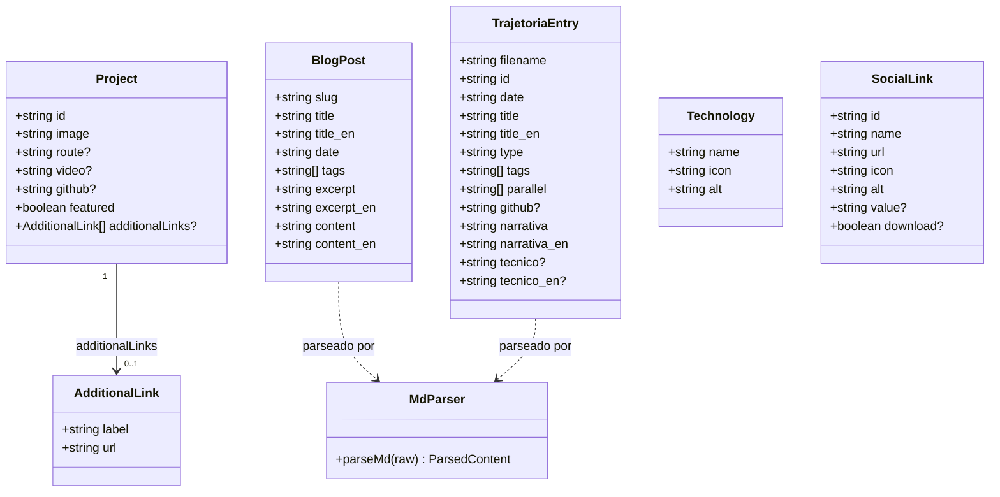
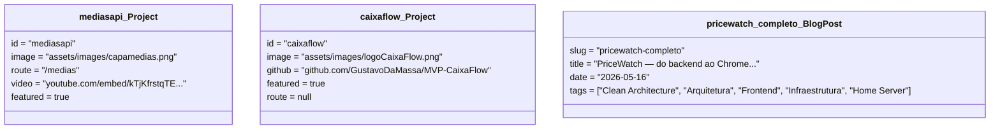
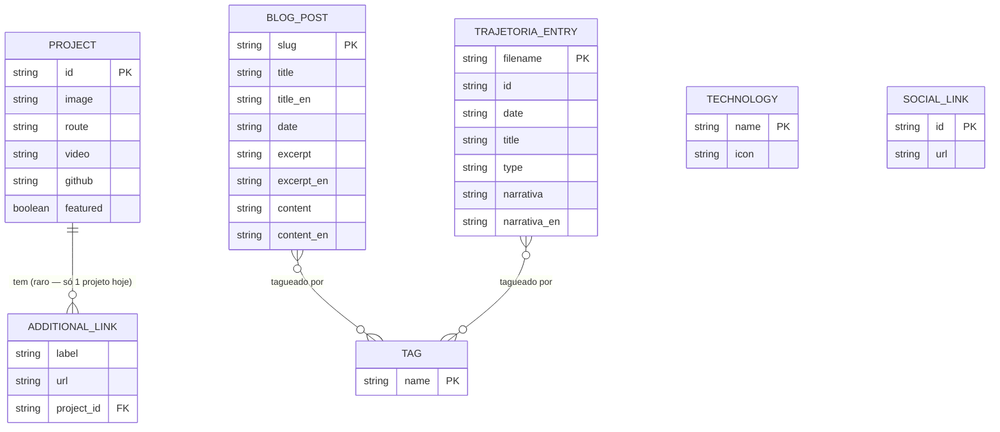

# Modelagem — Portfólio (gustavodevsite)

Reconstruído por engenharia reversa (Modo Produto, Fase A, 10/09/2026). O projeto não tem banco de dados nem classes de domínio tradicionais — é uma SPA estática. Os três diagramas abaixo foram adaptados pro que existe de fato: **modelo de dados de conteúdo** (o que normalmente seria persistência) e **estrutura de componentes** (o que normalmente seria domínio de aplicação).

## Diagrama de classes — modelo de conteúdo

Representa os registros de dados estáticos (`src/data/`) como classes, já que são eles que carregam a "lógica de domínio" desta aplicação (o que existe, quais campos são obrigatórios, como se relacionam).

**Notas de fidelidade ao código:**
- `Project` unifica `featuredProjects` e `projects` (dois arrays separados em `src/data/projects.js`, sem um campo `featured` explícito no array `projects` — o nome do array é que os diferencia). O atributo `featured` aqui é conceitual, não existe literalmente no segundo array.
- `route` só existe nos 3 projetos com página própria (`mediasapi`, `financeapi`, `pricewatch`); os demais projetos featured têm `github` no lugar. Ver gap em `docs/requisitos.md` (RF05).
- `TrajetoriaEntry.parallel` está vazio em todos os arquivos revisados — semântica exata (referência a outras entradas?) não confirmada, a validar com o dev.
- `MdParser` (`src/utils/parseMd.js`) não implementa os marcadores `NARRATIVA_IT`/`TECNICO_IT` — `TrajetoriaEntry`/`BlogPost` não têm campo `_it` porque o parser não os extrai hoje.

## Diagrama de objetos — cenário concreto

Duas instâncias reais, populadas a partir do código atual (Mermaid não tem notação nativa de diagrama de objetos — usando `classDiagram` anotado com valores, como orienta a skill):

O contraste entre `mediasapi_Project` (tem `route`, entra no fluxo interno do site) e `caixaflow_Project` (só `github`, sai da aplicação) é exatamente o gap RF05 registrado em `docs/requisitos.md`.

## Modelo de dados formal (adaptado de ER)

Sem banco de dados relacional — o "ER" aqui descreve os arquivos/módulos como registros e suas cardinalidades reais, não tabelas SQL.

`TECHNOLOGY` e `SOCIAL_LINK` não têm relação com nenhuma outra entidade no código atual — são listas independentes renderizadas em seções fixas (`TechStack`, `Footer`/`SideMenu`), sem vínculo por projeto ou por post. Se o retrofit de conteúdo (Fase B) quiser mostrar "tecnologias usadas neste projeto" por card, esse relacionamento `PROJECT }o--o{ TECHNOLOGY` **não existe hoje** e precisaria ser criado.
